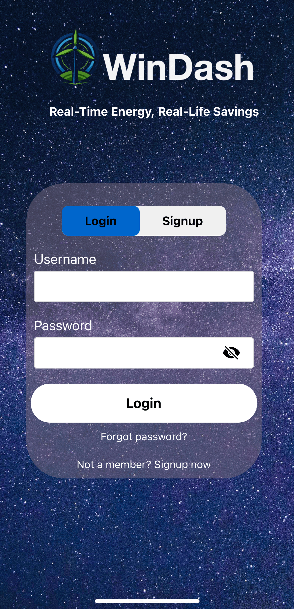
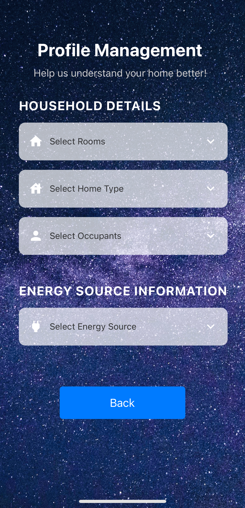

# Windash - Energy Monitoring Solution

Windash is an innovative React Native application designed to monitor and track household energy consumption. By providing real-time data insights, predictive analytics, and interactive reports, Windash empowers users to optimize their energy usage, save costs, and contribute to a greener environment.

## Table of Contents

1. [Features](#features)
2. [Snapshots](#snapshots)
3. [Installation](#installation)
4. [Usage](#usage)
5. [Screens Overview](#screens-overview)
6. [Technology Stack](#technology-stack)
7. [Contributing](#contributing)
8. [License](#license)
9. [Troubleshooting](#troubleshooting)

---

## Features

- **Real-time Energy Tracking**: Monitor live energy usage across different rooms and appliances.
- **Predictive Insights**: Utilize AI and machine learning to forecast future energy consumption.
- **Interactive Dashboard**: Visualize energy data through intuitive charts and graphs.
- **Customizable Reports**: Generate detailed reports tailored to your household setup.
- **Interactive Alerts**: Receive notifications when energy usage exceeds predefined thresholds.
- **Bill Estimation**: Estimate monthly electricity bills based on current usage trends.
- **Engaging UI**: A flower pot visual on the home screen provides a quick overview of energy performance.

---

## Snapshots

Here are some screenshots showcasing the Windash application in action:

### 1. **Login Screen**

### 2. **Profile Setup Screen**

### 3. **FlowerOne Dashboard**

### 4. **Flowerpot Detailed Dashboard**

### 5. **Live Energy Usage**

### 6. **Bill Estimation Screen**

*Replace the placeholder image paths (`./screenshots/`) with the actual paths where your screenshots are stored in the repository.*

---

## Installation

### Prerequisites

Before you begin, ensure you have met the following requirements:

- **Node.js**: Version 14.x or higher. [Download Node.js](https://nodejs.org/)
- **React Native CLI** or **Expo CLI**: Depending on your development choice.
- **Android Studio** or **Xcode**: For mobile device emulation.
- **Git**: For cloning the repository. [Download Git](https://git-scm.com/)
- **IDE**: Visual Studio Code is recommended. [Download VS Code](https://code.visualstudio.com/)

### Step-by-Step Installation

**Open your terminal and run the following commands to clone the repository and navigate to the project folder:**

Copy code in terminal 
git clone https://github.com/Abhinavmohindersingh/DECO3801.git
cd DECO3801
cd winDash
Install Dependencies

**Once you're in the project directory, install the necessary dependencies:**

npm install

**Run the Application**
To start the app in development mode, use the following command:

npm run start
This will open the development server for your Windash project, and you can proceed with testing or further development on your Android/iOS emulator or device.
